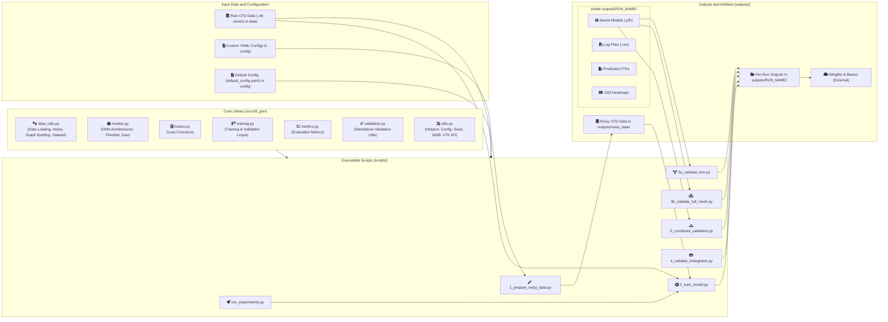
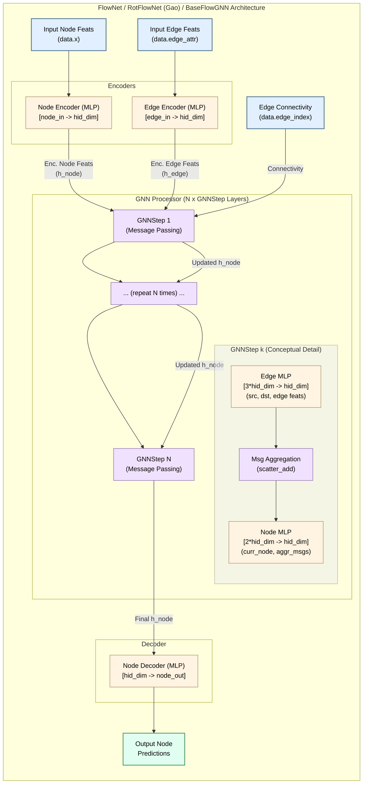
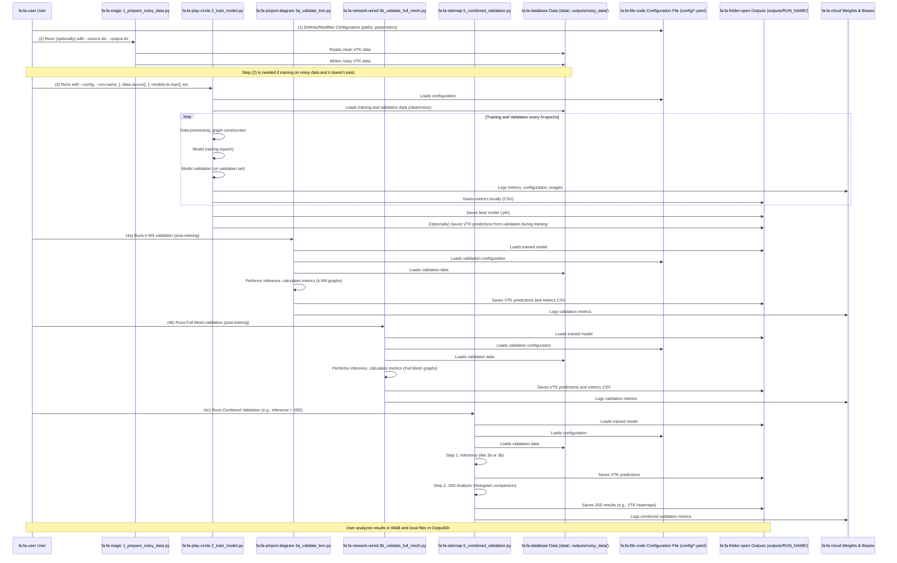

# CFD GNN Project

## What is this project about?

Imagine you want to understand how air flows around a car, how water moves through a pipe, or how heat spreads in a room. Traditionally, this involves complex calculations known as Computational Fluid Dynamics (CFD). This project explores a modern approach: using Artificial Intelligence, specifically Graph Neural Networks (GNNs), to learn and predict these fluid behaviors.

Think of it like teaching a computer to understand physics by showing it many examples. Once trained, our AI model can then make quick predictions about new scenarios, potentially speeding up design processes or offering new insights into fluid dynamics.

This toolkit provides everything you need to:

*   **Prepare data:** Take standard CFD simulation results and get them ready for the AI.
*   **Train AI models:** Teach different GNN models to understand fluid patterns.
*   **Test and validate:** Check how well the AI has learned and how accurate its predictions are.
*   **Analyze results:** Dig into the details of the predictions and compare them to traditional simulations.

Whether you're a researcher exploring AI for science, a student learning about GNNs, or an engineer interested in new simulation methods, this project offers tools and examples to get started.

## Who Might Find This Project Useful?

This project is designed for a range of individuals interested in the intersection of AI and scientific simulation:

*   **Researchers in AI/ML:** If you're exploring how Graph Neural Networks (GNNs) or other machine learning models can be applied to physics-based problems, this project provides a sandbox and a set of tools to experiment with CFD data.
*   **CFD Practitioners & Engineers:** If you work with Computational Fluid Dynamics and are curious about how AI can augment or accelerate traditional simulation workflows, this project offers a practical starting point. You could explore AI for tasks like surrogate modeling, parameter space exploration, or learning from existing simulation data.
*   **Students and Learners:** If you're studying GNNs, data-driven scientific computing, or advanced Python applications, this codebase can serve as a complex, real-world example. It demonstrates how to structure a larger project, manage data, configure experiments, and integrate various libraries.
*   **Software Developers:** If you're interested in the software architecture for scientific machine learning pipelines, this project showcases one way to organize such a system, from data preparation scripts to core model libraries and experiment logging.

**What background is helpful?**

*   **Some Python knowledge:** You'll be working with Python scripts and libraries.
*   **Familiarity with command-line basics:** Running scripts, navigating directories.
*   **Conceptual understanding of AI/ML (helpful but not essential to start):** Knowing a bit about training models, data, etc., will make things easier, but you can also learn as you go.
*   **Interest in fluid dynamics or CFD (helpful for context):** Understanding the data's origin can be beneficial, but the tools can be used even if you're primarily focused on the AI aspects.

The project aims to be a comprehensive toolkit, so different users might focus on different parts of it.

## Key Capabilities

This project is packed with features to help you explore AI for fluid dynamics:

*   **Flexible Toolkit (`src/cfd_gnn/`)**: A collection of building blocks for processing your simulation data, creating the network structures (graphs) our AI learns from, defining the AI models themselves, and checking how well they're doing.
*   **Step-by-Step Tools (`scripts/`)**: Easy-to-use scripts guide you through the whole process:
    *   `1_prepare_noisy_data.py`: Simulate real-world imperfections by adding noise to your data.
    *   `2_train_model.py`: Train your AI model to learn from the data.
    *   `3a_validate_knn.py` & `3b_validate_full_mesh.py`: Test your trained model using different ways of looking at the data points (k-NN or full mesh).
    *   `4_validate_histograms.py` & `5_combined_validation.py`: Perform in-depth checks on how well the model's predictions match the original simulations.
*   **Easy Experimentation**: Change how the AI learns and processes data through simple configuration files (YAML format). You can also adjust settings directly when you run a script.
*   **Track Your Progress (Weights & Biases)**: Automatically log and visualize your experiments, making it easy to compare results and share findings.
*   **Versatile Testing Methods**: Evaluate your AI models in different ways, whether by looking at nearby data points (k-NN) or the overall structure of the simulation (full mesh).

## Your First Journey with this Project: A Conceptual Walkthrough

So, you've got the project set up (as shown in "Getting Started: Setting Up Your Environment") and you're wondering: "What now?" Let's walk through a typical first exploration, focusing on the *why* and *what* rather than the specific commands (you can find those in the "Quick Start" and "Key Script Examples" sections).

**Phase 1: Understanding the Landscape**

1.  **Goal:** Get a feel for what this project does and how it's structured.
2.  **Your Steps:**
    *   **Read the Intro:** You've likely already read the "What is this project about?" and "Who Might Find This Project Useful?" sections. Good start!
    *   **Scan Key Capabilities:** This gives you a quick list of the main things you can do.
    *   **Look at the Pictures (Visual Project Overview):** The diagrams here are your maps.
        *   The "Project Component Architecture" shows how all the pieces (data, scripts, code) connect.
        *   The "Workflow" diagram gives you a bird's-eye view of the typical process. Don't memorize them, just get a general sense.
    *   **Peek at the Configuration (`config/default_config.yaml`):** Open this file. You don't need to understand every line, but scrolling through it shows you all the different settings you *can* control. This gives you an idea of the project's flexibility.

**Phase 2: A Simple First Experiment - Training on "Perfect" Data**

1.  **Goal:** Train an AI model on some clean, ideal simulation data to see if it can learn basic fluid patterns. This is like teaching a child to recognize shapes with perfect examples before showing them messy drawings.
2.  **Your Steps (Conceptual):**
    *   **Prepare Your Data:**
        *   You'll need some CFD simulation data (VTK files). If you don't have your own, you might look for example datasets or use a very simple one you create.
        *   Make sure the project knows where to find this data by setting the correct paths in a copy of the `default_config.yaml` file.
    *   **Choose Your Settings (Configuration):**
        *   For a first run, you might stick mostly to the defaults in your copied config file.
        *   You'd ensure settings point to your *clean* data for both training and any quick tests during training.
        *   You'd pick a model to train (e.g., "FlowNet").
        *   Give your experiment a unique name (e.g., "MyFirstCleanRun").
    *   **Start the Training:**
        *   You'd run the `2_train_model.py` script, telling it to use your configuration file.
    *   **Watch and Wait (a bit):**
        *   The script will start processing data, building the AI model, and then begin training. It will print updates to your screen.
        *   If you set up Weights & Biases, you could open your web browser and see graphs of how the model is learning in real-time!
    *   **Check the Output:**
        *   Once training is done, the project will save the trained AI model (usually in the `outputs/YourRunName/models/` folder). It will also have created log files with performance numbers.

**Phase 3: Seeing What the AI Learned**

1.  **Goal:** Take your newly trained AI model and test it on some data it hasn't seen before. How good are its predictions?
2.  **Your Steps (Conceptual):**
    *   **Choose Your Test Data:** This would typically be a separate set of clean simulation data that the AI wasn't trained on.
    *   **Run a Validation Script:** Use one of the validation scripts (like `3a_validate_knn.py` or `5_combined_validation.py`), telling it:
        *   Which trained AI model to use (the one you just saved).
        *   Where your test data is.
        *   Where to save the results of this test.
    *   **Examine the Results:**
        *   The script will produce detailed reports (often CSV files) showing various performance scores.
        *   Crucially, it will often save the AI's predictions as new VTK files. You can open these in a visualization tool (like ParaView) alongside the original "ground truth" VTK files to *see* how well the AI did. Are the flow patterns similar? Where does it make mistakes?

**Phase 4: Exploring Further**

From here, the path is yours! You might:

*   **Try Noisy Data:** See how the model performs if you train it on data with simulated imperfections (use `1_prepare_noisy_data.py` first). This is like seeing if the child can still recognize shapes in messy drawings.
*   **Experiment with Settings:** Change model size, training duration, or how data points are connected (graph type) in your configuration file and see how it affects the results.
*   **Dive Deeper into Analysis:** Use the "Detailed Data Probing" features to look at specific points or slices in your flow.
*   **Bring Your Own Data:** Adapt the project to work with your own CFD simulations.

This walkthrough is just one example. The key is to start simple, understand the basic workflow, and then gradually explore the more advanced features and settings as your curiosity and needs grow. Don't be afraid to experiment – that's what this toolkit is for!

## Visualizing the Project

To help you get a clearer picture of how this project works, we've included a few diagrams. These visuals show:

1.  **The Big Picture (Project Component Architecture):** How the different parts of the project (data, code, scripts, outputs) fit together.
2.  **Inside the AI (Model Architectures):** A simplified look at the structure of the AI models that learn to predict fluid behavior.
3.  **How Things Get Done (Workflow):** The typical steps you'd take when using the project, from preparing data to analyzing results.

Don't worry if these look complex at first! They're here to provide a map as you explore the project.

### 1. The Big Picture: Project Component Architecture

This diagram shows the main building blocks of the project and how they connect. You'll see where your data goes, which parts of the code do what, and where the results come from.



### 2. Inside the AI: Model Architectures

The AI models (FlowNet and RotFlowNet/Gao) are types of Graph Neural Networks. This diagram gives a simplified view of their internal structure, showing how they process information to make predictions.



### 3. How Things Get Done: Workflow

This diagram shows the usual order of operations when you use the project – from getting your data ready, to training the AI, and finally, checking its performance.



## Quick Start: What Can You Do?

This section gives you a hands-on look at how to use the project for common tasks. We'll show you the commands to run and briefly explain what they do.

**Before you begin:**
*   Make sure you're in the project's main directory and have your virtual environment activated (see "Setup" section).
*   **Configuration is Key:** Most settings are controlled by YAML files in the `config/` directory (like `default_config.yaml`). The commands below might mention specific settings to check in these files. You can also override many settings directly in the command line.
*   **Name Your Runs:** Use the `--run-name` option to give each experiment a unique name. This helps organize your results.
*   **Choose Your Model:** Use `--models-to-train` to pick the AI model you want to use (e.g., `FlowNet`).

### Scenario 1: Train and Test on "Perfect" (Clean) Data

*   **Goal:** See how well the AI can learn and make predictions when the data is ideal, without any simulated real-world imperfections (noise).
*   **Why this is useful:** This is a good starting point to check if the model can learn the basic physics from the simulation data.
*   **How-to:**
    *   You'll tell the training script to use `clean` data via `--data-source clean`.
    *   In your main YAML configuration file (e.g., `config/default_config.yaml`), ensure that the validation during training also uses clean data. Look for the `validation_during_training` section and ensure `use_noisy_data` is set to `false`.

```bash
python scripts/2_train_model.py \
    --config config/default_config.yaml \
    --run-name training_on_clean_data \
    --models-to-train FlowNet \
    --data-source clean \
    --epochs 100
```
*Developer Note: For the above command to work without YAML modification, `2_train_model.py` might need a direct CLI flag for `validation_during_training.use_noisy_data`.*

### Scenario 2: Train and Test on "Imperfect" (Noisy) Data

*   **Goal:** Train the AI on data that includes simulated noise (like you'd get from sensors in the real world) and test it on similarly noisy data.
*   **Why this is useful:** This helps assess how robust the model is and how well it performs in conditions that are closer to real-life applications.
*   **Before you start:**
    *   You'll need to create this "noisy" data first using the `1_prepare_noisy_data.py` script. Make sure the paths in your YAML configuration point to this noisy dataset.
    ```bash
    # Example: Creating noisy training data
    python scripts/1_prepare_noisy_data.py --source-dir /path/to/your/clean_training_data --output-dir /path/to/your/noisy_training_data
    # Example: Creating noisy validation data
    python scripts/1_prepare_noisy_data.py --source-dir /path/to/your/clean_validation_data --output-dir /path/to/your/noisy_validation_data
    ```
*   **How-to:**
    *   Tell the training script to use `noisy` data via `--data-source noisy`.
    *   In your YAML configuration, ensure `validation_during_training` also uses noisy data by setting `use_noisy_data: true`.

```bash
python scripts/2_train_model.py \
    --config config/default_config.yaml \
    --run-name training_on_noisy_data \
    --models-to-train FlowNet \
    --data-source noisy \
    --epochs 100
```

### Scenario 3: Train on Clean Data, Test on Noisy Data

*   **Goal:** See how well a model trained on "perfect" data can handle "imperfect" noisy data during testing.
*   **Why this is useful:** This tests the model's generalization. Can it apply what it learned in ideal conditions to a more challenging, noisy environment?
*   **Before you start:**
    *   Ensure you have noisy validation data prepared (see Scenario 2 for how to create it).
    *   Your YAML configuration should point to this noisy data for validation (e.g., `noisy_val_root`).
*   **How-to:**
    *   Train using `--data-source clean`.
    *   In your YAML configuration, for `validation_during_training`, set `use_noisy_data: true`.

```bash
python scripts/2_train_model.py \
    --config config/default_config.yaml \
    --run-name train_clean_val_noisy \
    --models-to-train FlowNet \
    --data-source clean \
    --epochs 100
```

### Scenario 4: Train on Noisy Data, Test on Clean Data

*   **Goal:** Determine if training on "imperfect" (noisy) data helps the model perform even better on "perfect" (clean) data.
*   **Why this is useful:** Sometimes, training on more challenging data can make a model more robust or highlight underlying patterns more effectively, leading to strong performance even on simpler data.
*   **Before you start:**
    *   Ensure you have noisy training data prepared (see Scenario 2).
    *   Your YAML configuration should point to clean data for validation (e.g., `val_root`).
*   **How-to:**
    *   Train using `--data-source noisy`.
    *   In your YAML configuration, for `validation_during_training`, set `use_noisy_data: false`.

```bash
python scripts/2_train_model.py \
    --config config/default_config.yaml \
    --run-name train_noisy_val_clean \
    --models-to-train FlowNet \
    --data-source noisy \
    --epochs 100
```

### Scenario 5: Choosing How Data Points are Connected (Graph Type)

The AI model in this project (a Graph Neural Network) learns from how data points are connected. You can choose different ways to define these connections:

*   **k-Nearest Neighbors (k-NN):** Each data point connects to its 'k' closest neighbors. Good for focusing on local interactions.
*   **Full Mesh:** Connections are based on the underlying grid structure of the simulation data (specifically, from tetrahedral cells). Good for capturing broader structural relationships.

*   **Goal:** Select the method (k-NN or Full Mesh) that the AI uses to see relationships in the data.
*   **Why this is useful:** Different connection types can affect what the model learns and how well it performs. Experimenting with this can lead to better results.
*   **How-to:** This is mainly controlled in your YAML configuration file.
    *   Find the `default_graph_type` setting and set it to `"knn"` or `"full_mesh"`.
    *   If using `"knn"`, you'll also want to look at `graph_config` to set `k` (number of neighbors) and `down_n` (how much to simplify the data, if at all).

**Example (section from a YAML file like `config/my_custom_config.yaml`):**
```yaml
# ... other settings ...

default_graph_type: "full_mesh"  # or "knn"

graph_config:
  k: 12          # Important for k-NN: number of neighbors
  down_n: 20000  # Important for k-NN: number of points to use (0 or null for all)
  # ... other graph-related settings ...

# ... rest of settings ...
```
Then, run your training script, making sure it uses this configuration file:
```bash
python scripts/2_train_model.py --config config/my_custom_config.yaml --run-name training_with_full_mesh --models-to-train FlowNet --epochs 100
```
*Developer Note: Currently, the graph type and its specific parameters (`k`, `down_n`) are set in the configuration file, not directly by command-line options to `2_train_model.py`.*

### Bonus: Running Many Experiments Automatically

If you want to try out many different settings or scenarios at once, the `scripts/run_experiments.py` script can help.

*   **Goal:** Automate running several training jobs with different configurations.
*   **Why this is useful:** Saves time and helps you systematically explore how different parameters affect the AI's performance.
*   **How-to:**
    1.  You'll need to edit the `scripts/run_experiments.py` file directly.
    2.  Inside this script, you can define a list of `experiments`. Each experiment can specify a base configuration file and then override specific settings (like the data source, number of epochs, or model parameters).
    3.  Set `BASE_CONFIG_PATH` to your main YAML configuration.
    4.  Define each variation in the `experiments` list.

**Example (conceptual snippet from `scripts/run_experiments.py`):**
```python
# In scripts/run_experiments.py
BASE_CONFIG_PATH = "config/default_config.yaml" # Your starting configuration
DEFAULT_EPOCHS = 50 # Default, can be overridden per experiment

experiments = [
    {
        "run_name_suffix": "try_clean_data",
        "data_source": "clean",
        "models_to_train": ["FlowNet"],
    },
    {
        "run_name_suffix": "try_noisy_data_more_epochs",
        "data_source": "noisy",
        "models_to_train": ["FlowNet"],
        "epochs": 150, # Override default epochs
    },
    # ... add more experiments here ...
]
# ... (rest of the script sets up and runs these) ...
```
After setting up `scripts/run_experiments.py`, you just run:
```bash
python scripts/run_experiments.py
```
This will then execute each defined experiment one after another.

## How the Project is Organized

This project has a few main parts that work together to help you train and use AI models for fluid dynamics. Here's a general idea of how it's laid out and what each part does:

**1. Configuration Files (`config/` directory): Your Control Panel**
   * This is where you tell the project what to do. These files (written in a format called YAML) hold all the important settings: where your data is, how the AI model should be built, how long to train it, etc.
   * `default_config.yaml` has standard settings, but you can create your own custom configs for different experiments.

**2. Your Data (`data/` directory, or your specified location): The Raw Material**
   * This is where you (typically) put your original CFD simulation data (usually a series of VTK files, which are like snapshots of the fluid flow).
   * The project reads this data to learn from.

**3. Scripts (`scripts/` directory): The Tools that Do the Work**
   * These are Python programs that perform specific tasks in the AI pipeline, like preparing data, training models, or testing them. You'll run these scripts from your command line.

**4. The "Brains" (`src/cfd_gnn/` directory): Core AI Engine**
   * This is the heart of the project. It contains all the underlying Python code that defines the AI models, handles data processing, calculates how well the model is doing, and more. You usually won't need to change things here unless you're doing advanced development.

**5. Results (`outputs/` directory): Where Your Findings Go**
   * When you run experiments, the project saves results here. This includes the trained AI models, performance metrics, prediction data, and any visualizations. Each experiment usually gets its own sub-folder.

Now, let's look at the typical steps you'd follow when using these parts.

### Typical Workflow: From Data to Insights

Using this project generally involves these stages:

1.  **Get Your Data Ready:**
    *   Start with your CFD simulation results (usually VTK files).
    *   If you want to test how the AI handles imperfect data, you can use a script (`scripts/1_prepare_noisy_data.py`) to add "noise" (random variations) to your clean data. This creates a new, noisy dataset.
        ```bash
        # Example: Making a noisy copy of your data
        python scripts/1_prepare_noisy_data.py --source-dir path/to/clean/data --output-dir path/to/noisy/data
        ```

2.  **Set Up Your Experiment (Configuration):**
    *   Edit a configuration file (like `config/default_config.yaml` or your own copy) to tell the project:
        *   Where to find your training and testing data.
        *   What kind of AI model to build (e.g., its size, layers).
        *   How to train it (e.g., learning speed, how many training cycles).
        *   How data points should be connected (graph type: k-NN or full mesh).
        *   Settings for logging your experiment (e.g., to Weights & Biases).

3.  **Train the AI Model:**
    *   Run the main training script (`scripts/2_train_model.py`), pointing it to your configuration file and giving your experiment a unique name.
        ```bash
        python scripts/2_train_model.py --config config/my_experiment_config.yaml --run-name my_first_ai_training
        ```
    *   What happens now?
        *   The script loads your data.
        *   It builds the AI model based on your settings.
        *   It repeatedly feeds data to the model, letting it learn and adjust itself.
        *   It regularly checks the model's performance on a separate test dataset.
        *   It saves progress, logs results (e.g., to CSV files and Weights & Biases), and stores the best version of your trained model.

4.  **Test and Analyze Your Trained Model:**
    *   Once training is done, you'll have a saved AI model. Now, you can test it more thoroughly.
    *   There are scripts to run your model on test data and see its predictions (e.g., `3a_validate_knn.py`, `3b_validate_full_mesh.py`, or `5_combined_validation.py` for a full analysis including detailed comparisons).
        ```bash
        # Example: Testing a model using k-NN style graphs
        python scripts/3a_validate_knn.py --model-checkpoint path/to/your/trained_model.pth --val-data-dir path/to/test/data ...
        ```
    *   These scripts will:
        *   Load your test data and your trained model.
        *   Make predictions using the model.
        *   Calculate various scores (metrics) to see how accurate the predictions are.
        *   Save the predictions (often as VTK files you can look at in visualization software) and detailed score reports.

5.  **Review Your Results:**
    *   Look at the charts and numbers logged in Weights & Biases (if you used it).
    *   Examine the score reports (CSV files) for detailed performance.
    *   Open the predicted VTK files in a program like ParaView to visually compare the AI's output to the original simulations. This helps you understand *what* the AI learned.

This step-by-step approach allows you to experiment with different settings, AI models, and data types, and to systematically evaluate the outcomes.

## Project Structure

```
.
├── config/
│   └── default_config.yaml       # Default configuration for all scripts
├── data/
│   └── .gitkeep                  # Placeholder for input CFD datasets (see below)
├── outputs/
│   └── .gitkeep                  # Default for generated outputs (models, predictions, logs) - gitignored
├── scripts/                      # Executable Python scripts for pipeline stages
│   ├── 1_prepare_noisy_data.py
│   ├── 2_train_model.py
│   ├── ...
├── src/
│   └── cfd_gnn/                  # Core library package
│       ├── __init__.py
│       ├── data_utils.py         # Data loading, noise, graph building, Dataset class
│       ├── losses.py             # Custom loss functions
│       ├── metrics.py            # Evaluation metrics (TKE, CosSim, JSD, Vorticity)
│       ├── models.py             # GNN model definitions (FlowNet, RotFlowNet)
│       ├── training.py           # Training and during-training validation loops
│       ├── utils.py              # General helper functions (config, seed, W&B, VTK I/O)
│       └── validation.py         # Standalone validation utilities (JSD pipeline)
├── tests/                        # (Optional) Unit and integration tests
├── .gitignore
├── README.md
└── requirements.txt
```

## Getting Started: Setting Up Your Environment

Ready to try it out? Here's how to get the project set up on your computer. If you're new to Python projects or command-line tools, take these steps one at a time.

**Who is this for?** This project is useful if you have some experience with Python and are interested in machine learning, fluid dynamics, or scientific computing. You don't need to be an expert in GNNs or CFD to start exploring.

1.  **Copy the Project (Clone the Repository):**
    *   First, you need a copy of the project files. If you have `git` installed, open your terminal or command prompt and run:
        ```bash
        git clone <repository_url>
        cd cfd-gnn-project # Or the name you gave the folder
        ```
    *   (If you don't use git, you might download the project as a ZIP file and extract it.)

2.  **Create a Clean Workspace (Virtual Environment - Recommended):**
    *   To keep things tidy and avoid conflicts with other Python projects, it's best to create a "virtual environment." This is like a private sandbox for this project.
        ```bash
        python -m venv venv  # Creates a virtual environment named 'venv'
        ```
    *   Now, activate it:
        *   On **Linux or macOS**: `source venv/bin/activate`
        *   On **Windows**: `venv\Scripts\activate`
    *   You should see `(venv)` appear at the beginning of your terminal prompt. This means you're "inside" the sandbox.

3.  **Install the Tools (Dependencies):**
    *   This project relies on several Python libraries. Install them all with:
        ```bash
        pip install -r requirements.txt
        ```
    *   **Important Note on PyTorch:** Some libraries, especially `torch`, `torch-scatter`, and `torch-geometric` (which are key for the AI parts), can be tricky. If the command above gives errors related to these, you might need to install them separately by following instructions from the [official PyTorch website](https://pytorch.org/get-started/locally/), making sure to choose versions compatible with your computer (e.g., if you have an NVIDIA GPU for CUDA). The `requirements.txt` file provides versions that are known to work together.

4.  **Get Your Data Ready:**
    *   The AI needs data to learn from. This project usually expects CFD simulation data stored as `.vtk` files.
    *   You can place your data inside the `data/` folder, or anywhere else and tell the project where to find it using the configuration files (see "How the Project is Organized").
    *   A typical way to organize data for a simulation case (e.g., "MyFlowSimulation") might look like this:
        ```
        data/
        └── MyFlowSimulation/
            ├── SimulationCaseA/
            │   └── CFD/
            │       ├── snapshot_00.vtk
            │       ├── snapshot_01.vtk
            │       └── ...
            └── SimulationCaseB/
                └── CFD/
                    ├── snapshot_00.vtk
                    └── ...
        ```
    *   You'll later specify paths like `data/MyFlowSimulation` in your configuration file (e.g., in `config/default_config.yaml` for `train_root` or `val_root`).

5.  **Connect to Experiment Tracking (Weights & Biases - Optional but Recommended):**
    *   This project can automatically log your experiments (settings, results, charts) to a free online service called [Weights & Biases (W&B)](https://wandb.ai/). This is super helpful for keeping track of what you've tried.
    *   If you want to use it:
        1.  Create a free W&B account on their website.
        2.  Log in from your terminal:
            ```bash
            wandb login
            ```
            (It will ask for an API key, which you can find on your W&B profile page.)
    *   You can tell the project which W&B "project" to send results to in your configuration file.

With these steps done, you should be ready to run your first experiments!

## Understanding Configuration: Telling the Scripts What to Do

This project uses simple text files (in YAML format) to manage settings for your experiments. Think of them as control panels for the scripts.

*   **Central Hub (`config/` directory):** All configuration files live here.
*   **The Default Settings (`config/default_config.yaml`):** This file contains standard settings for everything – from where your data is located, to how the AI model should be built, and how it should be trained. You can look at this file to see all the available options.
*   **Your Own Custom Settings:**
    *   It's a good idea to **copy `default_config.yaml`** and rename it (e.g., `my_experiment.yaml`) for your own experiments. This way, you can change settings without altering the original defaults.
    *   When you run a script, you can tell it to use your custom file with the `--config` option, like this:
        ```bash
        python scripts/2_train_model.py --config config/my_experiment.yaml --run-name my_test
        ```
*   **Quick Changes (Command-Line Overrides):** Need to quickly change a setting for just one run? You can often do this directly in the command line when you run a script. These command-line options will temporarily override what's in your YAML file. For example:
    ```bash
    # This will use 'clean' data, even if your YAML says 'noisy'
    python scripts/2_train_model.py --config config/my_experiment.yaml --data-source clean
    ```
*   **Specific Options:**
    *   **Choosing Data Type:** The main training script (`2_train_model.py`) has a handy `--data-source` flag to quickly switch between using `clean` or `noisy` data.
    *   **Saving Detailed Visuals:** If you want to save detailed visual outputs (VTK files) showing things like prediction errors or vorticity during training, you can turn this on in your YAML file. Look for `save_validation_fields_vtk: true` inside the `validation_during_training` section.

By understanding and using these configuration files, you have fine-grained control over every aspect of your AI experiments.

## Key Script Examples at a Glance

Here's a quick look at the main scripts and what they do. For more detailed scenarios, see the "Quick Start: What Can You Do?" section. For a full list of options for any script, run it with the `-h` or `--help` flag (e.g., `python scripts/1_prepare_noisy_data.py -h`).

All commands should be run from the main project directory.

**1. `1_prepare_noisy_data.py`: Create a Noisy Version of Your Data**
   * Use this to simulate imperfections or sensor noise in your clean CFD data.
   ```bash
   python scripts/1_prepare_noisy_data.py --source-dir path/to/clean_data_cases --output-dir path/to/noisy_data_output --p-min 0.05 --p-max 0.15
   ```

**2. `2_train_model.py`: Train Your AI Model**
   * This is the main script to train the GNN models (FlowNet, Gao/RotFlowNet).
   ```bash
   python scripts/2_train_model.py --config config/your_config.yaml --run-name my_training_run_01 --models-to-train FlowNet --epochs 100
   ```

**3. `3a_validate_knn.py`: Test Model with k-NN Graphs**
   * Evaluates your trained model using graphs where points connect to their 'k' nearest neighbors.
   ```bash
   python scripts/3a_validate_knn.py --model-checkpoint path/to/your_model.pth --model-name FlowNet --val-data-dir path/to/validation_cases --output-dir path/to/validation_results_knn
   ```

**4. `3b_validate_full_mesh.py`: Test Model with Full Mesh Graphs**
   * Evaluates your trained model using graphs based on the original simulation mesh structure.
   ```bash
   python scripts/3b_validate_full_mesh.py --model-checkpoint path/to/your_model.pth --model-name FlowNet --val-data-dir path/to/validation_cases --output-dir path/to/validation_results_fullmesh
   ```

**5. `4_validate_histograms.py`: Compare Data Distributions (JSD)**
   * Compares datasets (e.g., AI predictions vs. original data) by looking at how their data values are distributed.
   ```bash
   python scripts/4_validate_histograms.py --real-data-dir path/to/ground_truth_data --pred-data-dir path/to/model_prediction_data --output-dir path/to/histogram_results
   ```

**6. `5_combined_validation.py`: Full Validation (Inference + Analysis)**
   * Runs a complete validation pipeline: makes predictions with your model and then performs detailed analysis (like histogram comparisons).
   ```bash
   python scripts/5_combined_validation.py --model-checkpoint path/to/your_model.pth --model-name FlowNet --val-data-dir path/to/validation_cases --output-dir path/to/combined_validation_output --graph-type knn
   ```

**7. `7_create_visualizations.py`: Plot Time-Series Probe Data**
   * If you've extracted time-series data from points or slices (see "Time-Series Probing" section), this script creates interactive plots.
   ```bash
   python scripts/7_create_visualizations.py --points-csv path/to/probed_points.csv --output-dir path/to/visualizations/
   ```

## Advanced Feature: Detailed Data Probing & Time Analysis

Beyond overall model performance, you might want to zoom in on specific areas of your simulation or track how values change over time at certain locations. This project includes tools for such detailed analysis.

**What can you do with this?**

*   **Track Data at Specific Points:** Pick any X,Y,Z coordinate in your simulation, and the tools will extract data (like velocity, pressure, etc.) from the nearest simulation point across all time steps.
*   **Analyze Data on Slices:** Define a 2D plane (a slice) through your 3D simulation (e.g., "a vertical slice at X=0.5m"). The tools will gather data for all simulation points lying on or near this slice.
*   **Calculate Physics Quantities:** For these points and slices, the system can also compute physics-based values like vorticity (local spinning motion) or velocity gradients.
*   **Compare True vs. Predicted Over Time:** If you run this analysis on both your original simulation data and the AI's predictions, you can generate time-series plots to see exactly how well the AI matches reality at these specific locations.

**How it Works:**

1.  **Configuration is Key:**
    *   **Defining Probes:** In your YAML configuration file (e.g., `config/default_config.yaml`), you'll find an `analysis_probes` section. Here you can list X,Y,Z coordinates for point probes, or define slices (e.g., by axis like "X", position like `0.05`, and thickness). Remember to set `enabled: true` for the probes you want to use.
        ```yaml
        # Example snippet from config/default_config.yaml
        analysis_probes:
          points:
            enabled: true # Enable point probing
            coordinates:
              - [0.05, 0.01, 0.0] # Define a point
              - [0.10, 0.02, 0.0] # Define another point
            velocity_field_name: "velocity" # VTK field name for velocity
          slices:
            enabled: true # Enable slice probing
            definitions:
              - {axis: "X", position: 0.05, thickness: 0.005} # Define a slice
            velocity_field_name: "velocity_on_slice" # Or appropriate field name
        ```
    *   **Time Extraction:** The system also needs to know how time is recorded in your VTK files. The `time_extraction` section in the YAML config lets you specify this (e.g., from a data field in the VTK, by parsing the filename, or by assuming a fixed time step).

2.  **Generating Probe Data (using `scripts/5_combined_validation.py`):**
    *   The same script you use for comprehensive model validation, `5_combined_validation.py`, also handles probe data generation.
    *   Ensure your YAML config has `time_extraction` and `analysis_probes` set up correctly.
    *   Run the script, pointing to your model, validation data, and config:
        ```bash
        python scripts/5_combined_validation.py --config path/to/your_config.yaml --model-checkpoint path/to/model.pth --val-data-dir path/to/validation_cases --output-dir path/to/output_run_dir
        ```
    *   **Output:** This creates CSV files (e.g., `probed_points_data_MODEL_GRAPH.csv`, `probed_slices_data_MODEL_GRAPH.csv`) in your run's output directory. These files contain the extracted data (true and predicted values, if applicable) and calculated quantities for each probe over time.

3.  **Visualizing Probe Data (using `scripts/7_create_visualizations.py`):**
    *   To see your time-series data plotted, use the `7_create_visualizations.py` script.
    *   Point it to the CSV files generated in the previous step:
        ```bash
        python scripts/7_create_visualizations.py \
            --points-csv path/to/output_run_dir/model_predictions/probed_points_data_MODEL_GRAPH.csv \
            --slices-csv path/to/output_run_dir/model_predictions/probed_slices_data_MODEL_GRAPH.csv \
            --output-dir path/to/save_visualizations/ \
            --model-name "YourModelName"
        ```
    *   **Output:** This generates interactive HTML plots, making it easy to compare trends and values over time for each point or slice.

**A Note on Dependencies:** These probing and visualization features use a few extra Python libraries (`scipy`, `plotly`, `kaleido`). They are included in the main `requirements.txt` file.

## Notes for Developers & Advanced Users

If you plan to modify the code or delve deeper:

*   **GPU/CPU Usage:** The scripts automatically try to use a CUDA-enabled GPU if available and configured. You can specify this in the config or via command-line options; otherwise, it falls back to CPU.
*   **VTK Data Fields:** When working with your own VTK files, make sure the names of data fields (like velocity, pressure) in your files match what's expected in the project's configuration (e.g., `velocity_key`, `pressure_key`).
*   **Error Debugging:** While the scripts have some error checks, complex data or setup issues might need more detailed debugging.
*   **Contributing Tests:** If you extend the core library (`src/cfd_gnn/`), please consider adding corresponding unit tests in the `tests/` folder.

## Future Ideas & Contributions

This project is a foundation. Here are some ways it could grow (contributions welcome!):

*   **Smarter Data Handling:** Advanced data augmentation methods.
*   **New AI Models:** Adding support for different types of Graph Neural Networks.
*   **Automated Tuning:** Scripts for automatically finding the best AI model settings (e.g., using Weights & Biases Sweeps).
*   **Richer Analysis:** More tools for in-depth result checking, like plotting velocity profiles or calculating pressure drops.
*   **Workflow Integration:** Connecting with tools like Snakemake or Nextflow for managing complex series of jobs.

## Time-Series Probing and Analysis (New Features)

This project now includes capabilities to extract time-series data at specific user-defined points and planar slices from VTK simulation outputs. It can also calculate several Navier-Stokes related quantities at these probe locations.

### 1. Time Extraction from VTK

VTK files often store simulation time in various ways. The system now attempts to extract this time information to associate it with each data frame.

**Configuration (`config/default_config.yaml`):**

The `time_extraction` section in the configuration file controls how time is determined:

```yaml
time_extraction:
  # method_priority: Defines the order of methods to attempt for extracting time.
  #   - "field_data": Looks in VTK's field data arrays (e.g., global time value).
  #   - "filename": Parses the VTK filename using a regex.
  #   - "fixed_dt": Calculates time as frame_index * simulation_dt.
  method_priority: ["field_data", "filename", "fixed_dt"]

  # field_data_keys: List of keys to search for in mesh.field_data.
  field_data_keys: ["TimeValue", "TIME", "Time", "time"]

  # filename_pattern: Regex for "filename" method. Must have one capturing group for the time value.
  # Example: ".*_t(\\d+\\.\\d+)\\.vtk" (for "case_t0.015.vtk")
  filename_pattern: null

  # simulation_dt: Fixed time step for "fixed_dt" method.
  simulation_dt: 0.01
```
The `data_utils.py` script uses this configuration when loading VTK files, adding a `data.time` attribute to the PyTorch Geometric `Data` objects.

### 2. Point and Slice Probes

You can define specific points and slices where data (velocity, vorticity, gradients, divergence) should be extracted over time.

**Configuration (`config/default_config.yaml`):**

The `analysis_probes` section controls this:

```yaml
analysis_probes:
  points:
    enabled: false # Set to true to enable
    coordinates: # List of [x,y,z] coordinates
      # - [0.05, 0.01, 0.0]
      # - [0.10, 0.02, 0.0]
    velocity_field_name: "velocity"

  slices:
    enabled: false # Set to true to enable
    definitions: # List of slice definitions
      # - {axis: "X", position: 0.05, thickness: 0.005}
      # - {axis: "Y", position: 0.0,  thickness: 0.01}
    velocity_field_name: "velocity_on_slice"
```

*   **Point Probes**: Data is sampled at the mesh node nearest to each specified coordinate.
*   **Slice Probes**: Data is extracted for all mesh nodes falling within the defined slice (axis, position, thickness). For CSV outputs, metrics are typically averaged over the slice.

### 3. Generating Probe Data

The script `scripts/5_combined_validation.py` (which is also used for general model validation) has been extended to generate this time-series probe data.

*   **How to Run**:
    1.  Ensure your main configuration YAML (e.g., `config/default_config.yaml` or a custom one) has the `time_extraction` and `analysis_probes` sections correctly set up (e.g., `enabled: true` for the probes you want).
    2.  Run the script, for example:
        ```bash
        python scripts/5_combined_validation.py --config path/to/your_config.yaml --model-checkpoint path/to/model.pth --model-name YourModel --val-data-dir path/to/validation_cases --output-dir path/to/output_run_dir
        ```
*   **Output**:
    *   If point probes are enabled, a CSV file named `probed_points_data_MODEL_GRAPH.csv` will be created in the `output_run_dir/model_predictions/` directory.
    *   If slice probes are enabled, a CSV file named `probed_slices_data_MODEL_GRAPH.csv` will be created similarly.
    *   These CSVs contain columns for time, probe definition, true and predicted velocity, vorticity, divergence, and velocity gradients (for points).

**Structure of Output CSVs (Example Columns):**

*   **Points CSV (`probed_points_data_...csv`):**
    `case_name, frame_file, time, target_point_coords, actual_point_coords, distance_to_actual, true_velocity, pred_velocity, true_vort_mag, pred_vort_mag, true_grad_dudx, ..., pred_grad_dwdz, true_divergence, pred_divergence`
    (Note: `true_velocity`, `pred_velocity`, `target_point_coords`, `actual_point_coords` will be string representations of lists, e.g., `'[0.1, 0.2, 0.3]'`)

*   **Slices CSV (`probed_slices_data_...csv`):**
    `case_name, frame_file, time, slice_axis, slice_position, slice_thickness, num_points_true, avg_true_vel_mag, num_points_pred, avg_pred_vel_mag, avg_true_vort_mag_slice, avg_pred_vort_mag_slice, avg_true_divergence_slice, avg_pred_divergence_slice`

This data is intended for use in detailed analysis or as input for "training" processes that require time-dependent data with NS-related physical quantities.

### 4. Visualizing Probe Data

The script `scripts/7_create_visualizations.py` can be used to generate interactive HTML plots from the probe data CSVs.

*   **How to Run**:
    ```bash
    python scripts/7_create_visualizations.py \
        --points-csv path/to/output_run_dir/model_predictions/probed_points_data_MODEL_GRAPH.csv \
        --slices-csv path/to/output_run_dir/model_predictions/probed_slices_data_MODEL_GRAPH.csv \
        --output-dir path/to/save_visualizations/ \
        --model-name "YourModelName"
    ```
    (Provide either or both CSV paths)
*   **Output**: The script generates interactive HTML line plots for each unique point and slice, showing comparisons of true vs. predicted quantities over time.

### 5. New Dependencies

Make sure you have the following new dependencies installed if you use these features:
*   `scipy`: For nearest-neighbor lookups in point probing.
*   `plotly`: For generating interactive visualizations.
*   `kaleido`: For potential static image export from Plotly (though current script focuses on HTML).

Install them via: `pip install scipy plotly kaleido` (or add to `requirements.txt` and install). `scipy`, `plotly`, and `kaleido` have been added to the main `requirements.txt`.
