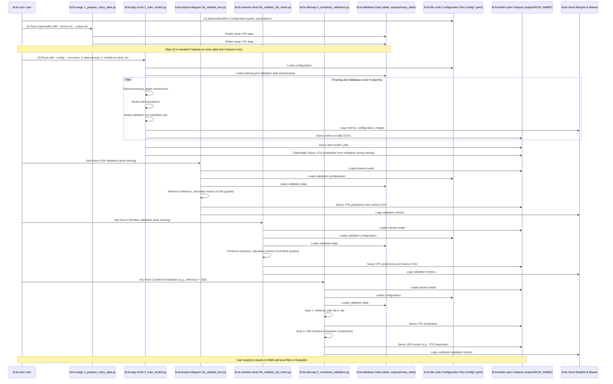

# CFD GNN Project

This project provides a comprehensive suite for training and validating Graph Neural Network (GNN) models on Computational Fluid Dynamics (CFD) data. It supports noise injection, model training (FlowNet, RotFlowNet/Gao), various validation techniques (k-NN graph based, full mesh graph based, histogram JSD analysis), and extensive logging with Weights & Biases.

## Core Features

*   **Modular Library (`src/cfd_gnn/`)**: Reusable components for data processing, graph construction, GNN models, loss functions, metrics, training loops, and validation routines.
*   **Script-based Workflow (`scripts/`)**: Individual scripts for each stage of the pipeline:
    *   `1_prepare_noisy_data.py`: Injects MRI-like noise into CFD datasets.
    *   `2_train_model.py`: Main training script for GNN models.
    *   `3a_validate_knn.py`: Validates models using k-NN graphs.
    *   `3b_validate_full_mesh.py`: Validates models using full mesh (tetrahedral) graphs.
    *   `4_validate_histograms.py`: Performs standalone JSD histogram validation.
    *   `5_combined_validation.py`: Orchestrates inference and JSD validation.
*   **Configurable Pipeline**: Uses YAML configuration files (`config/default_config.yaml`) with CLI overrides for flexible experimentation.
*   **Weights & Biases Integration**: Comprehensive logging of metrics, configurations, and artifacts.
*   **Multiple Validation Strategies**: Supports both geometry-based graph construction (k-NN) and topology-based (full mesh from tetrahedra).

## Visual Project Overview

To better understand the project's organization and typical task execution, diagrams are provided below.

### Project Component Architecture

This diagram shows the main building blocks of the project and their interconnections.

```mermaid
graph LR
    subgraph UserInput[Input Data and Configuration]
        direction LR
        rawData["fa:fa-database Raw CFD Data (.vtk series) in data/"]
        customConfig["fa:fa-file-code Custom YAML Configs in config/"]
        defaultConfig["fa:fa-file-alt Default Config (default_config.yaml) in config/"]
    end

    subgraph CoreLogic[Core Library (src/cfd_gnn)]
        direction TB
        dataUtils[fa:fa-cogs data_utils.py<br>(Data Loading, Noise, Graph Building, Dataset)]
        models[fa:fa-brain models.py<br>(GNN Architectures: FlowNet, Gao)]
        losses[fa:fa-calculator losses.py<br>(Loss Functions)]
        training[fa:fa-person-chalkboard training.py<br>(Training & Validation Loops)]
        metrics[fa:fa-chart-line metrics.py<br>(Evaluation Metrics)]
        validation[fa:fa-check-double validation.py<br>(Standalone Validation Utils)]
        utils[fa:fa-tools utils.py<br>(Helpers: Config, Seed, W&B, VTK I/O)]
    end

    subgraph Scripts[Executable Scripts (scripts/)]
        direction TB
        script1[fa:fa-magic 1_prepare_noisy_data.py]
        script2[fa:fa-play-circle 2_train_model.py]
        script3a[fa:fa-project-diagram 3a_validate_knn.py]
        script3b[fa:fa-network-wired 3b_validate_full_mesh.py]
        script4[fa:fa-image 4_validate_histograms.py]
        script5[fa:fa-sitemap 5_combined_validation.py]
        scriptRunExp[fa:fa-rocket run_experiments.py]
    end

    subgraph Outputs[Outputs and Artifacts (outputs/)]
        direction LR
        noisyData[fa:fa-database Noisy CFD Data in outputs/noisy_data/]
        runOutputs[fa:fa-folder-open Per-Run Outputs in outputs/RUN_NAME/]
        subgraph RunSpecific[Inside outputs/RUN_NAME/]
            direction TB
            trainedModels[fa:fa-save Saved Models (.pth)]
            logFiles[fa:fa-file-csv Log Files (.csv)]
            predictionVTKs[fa:fa-file-export Predicted VTKs]
            jsdHeatmaps[fa:fa-map JSD Heatmaps]
        end
        wandb[fa:fa-cloud Weights & Biases (External)]
    end

    %% Connections
    rawData --> script1
    defaultConfig --> Scripts
    customConfig --> Scripts

    script1 --> noisyData

    CoreLogic --> Scripts

    script2 --> runOutputs
    script3a --> runOutputs
    script3b --> runOutputs
    script4 --> runOutputs
    script5 --> runOutputs
    scriptRunExp ----> script2

    noisyData --> script2
    rawData --> script2

    trainedModels --> script3a
    trainedModels --> script3b
    trainedModels --> script5

    runOutputs --> wandb
```

### Workflow

This diagram illustrates the typical sequence of steps performed when working with the project, from data preparation to results analysis.



## Common Usage Scenarios (Quick Start)

Below are examples of how to run training and validation for various common setups. These assume you are in the project's root directory and have your virtual environment activated.

**Important Notes Before Starting:**

*   **Configuration File:** Many settings (e.g., paths to main datasets `train_root`, `val_root`, model parameters like `h_dim`, `layers`) are loaded from a YAML file (e.g., `config/default_config.yaml`, `config/test_config.yaml` for `run_experiments.py`, or a file specified by `--config`). The CLI flags shown below can override values from the configuration file.
*   **Noisy Data Preparation:** If your scenario involves using noisy data (`--data-source noisy` or if it's the default in your config), ensure it has been generated beforehand using `scripts/1_prepare_noisy_data.py`. Paths to this data (`noisy_train_root`, `noisy_val_root`) should also be correctly set in your configuration file.
*   **Run Name (`--run-name`):** Always provide a unique and descriptive name for each run. It will be used to create an output directory in `outputs/` and to identify the run in Weights & Biases.
*   **Model to Train (`--models-to-train`):** Specify which model you want to train, e.g., `FlowNet` or `Gao`.

### Scenario 1: Training and Validation on CLEAN Data

*   **Goal:** The model learns and is evaluated on ideal data, without simulated noise.
*   **How:** Use the `--data-source clean` flag. Additionally, in your YAML configuration file, under the `validation_during_training` section, set `use_noisy_data: false`.

```bash
python scripts/2_train_model.py \
    --config config/default_config.yaml \
    --run-name training_on_clean_data \
    --models-to-train FlowNet \
    --data-source clean \
    --epochs 100
    # Ensure your default_config.yaml (or your --config file) has:
    # validation_during_training:
    #   enabled: true
    #   use_noisy_data: false
```
*If you want the command above to work without modifying the YAML file, `2_train_model.py` would need an additional CLI flag to control `validation_during_training.use_noisy_data`, or this logic would need to be more tightly coupled with `--data-source`.*

### Scenario 2: Training and Validation on NOISY Data

*   **Goal:** A standard case where the model learns on data with added noise (simulating measurement inaccuracies, etc.) and is validated on a similarly noisy dataset.
*   **How:** Use the `--data-source noisy` flag (this is often the default if the flag is omitted, but depends on `2_train_model.py`'s implementation and config file settings). In your YAML, `validation_during_training.use_noisy_data: true`.

```bash
# Ensure noisy data exists at the paths specified in your configuration!
# e.g., /home/student2/ethz/CFD_Ubend_other_noisy (as per test_config.yaml)
# You can generate it with 1_prepare_noisy_data.py:
# python scripts/1_prepare_noisy_data.py --source-dir /path/to/clean/train --output-dir /path/to/noisy/train [--p-min ...] [--p-max ...]
# python scripts/1_prepare_noisy_data.py --source-dir /path/to/clean/val --output-dir /path/to/noisy/val [--p-min ...] [--p-max ...]

python scripts/2_train_model.py \
    --config config/default_config.yaml \
    --run-name training_on_noisy_data \
    --models-to-train FlowNet \
    --data-source noisy \
    --epochs 100
    # Ensure your default_config.yaml (or your --config file) has:
    # validation_during_training:
    #   enabled: true
    #   use_noisy_data: true
```

### Scenario 3: Training on CLEAN Data, Validation on NOISY Data

*   **Goal:** Test how a model trained on ideal data performs in noisy conditions.
*   **How:** Use `--data-source clean` for training. In YAML, set `validation_during_training.use_noisy_data: true` for validation during training.

```bash
python scripts/2_train_model.py \
    --config config/default_config.yaml \
    --run-name train_clean_val_noisy \
    --models-to-train FlowNet \
    --data-source clean \
    --epochs 100
    # Ensure your default_config.yaml (or your --config file) has:
    # validation_during_training:
    #   enabled: true
    #   use_noisy_data: true
    # (and that noisy_val_root points to noisy validation data)
```

### Scenario 4: Training on NOISY Data, Validation on CLEAN Data

*   **Goal:** See if a model trained on "harder" (noisy) data can generalize well to ideal, clean conditions.
*   **How:** Use `--data-source noisy` for training. In YAML, set `validation_during_training.use_noisy_data: false` for validation during training.

```bash
python scripts/2_train_model.py \
    --config config/default_config.yaml \
    --run-name train_noisy_val_clean \
    --models-to-train FlowNet \
    --data-source noisy \
    --epochs 100
    # Ensure your default_config.yaml (or your --config file) has:
    # validation_during_training:
    #   enabled: true
    #   use_noisy_data: false
    # (and that val_root points to clean validation data)
```

### Scenario 5: Controlling Graph Type (k-NN vs. Full Mesh)

*   **Goal:** Choose the graph construction method for the model.
*   **How:** Primarily through the YAML configuration file. In your `graph_config` section (or similar, depending on your YAML structure; e.g., `test_config.yaml` has `default_graph_type` and `graph_config`):
    *   For **k-NN**: set `default_graph_type: "knn"`, and define `graph_config.k` (number of neighbors) and `graph_config.down_n` (number of points after downsampling; `null` or `0` for no downsampling).
    *   For **Full Mesh**: set `default_graph_type: "full_mesh"`. Parameters `k` and `down_n` are then usually ignored.

**Example (modifying a section of your YAML, e.g., `my_custom_config.yaml`):**

```yaml
# ... other settings ...

default_graph_type: "full_mesh" # or "knn"

graph_config:
  k: 12          # Relevant for knn
  down_n: 20000  # Relevant for knn, null or 0 for no downsampling
  # ... other graph_config parameters

# ... rest of settings ...
```

Then, run training with this configuration file:
```bash
python scripts/2_train_model.py --config config/my_custom_config.yaml --run-name training_with_full_mesh --models-to-train FlowNet --epochs 100
```
*Currently, `2_train_model.py` does not have CLI flags to directly switch `default_graph_type` or parameters like `k` and `down_n`. These must be set in the configuration file.*

### Running Multiple Experiments (using `scripts/run_experiments.py`)

The `scripts/run_experiments.py` script is designed to run a series of predefined experiments. To use it for a specific scenario from above:

1.  **Modify `scripts/run_experiments.py`**:
    *   Set `BASE_CONFIG_PATH` to a YAML file that has most of the required settings (e.g., correct paths, `validation_during_training.use_noisy_data`).
    *   In the `experiments` list, leave or create only one dictionary that overrides parameters according to your chosen scenario (e.g., adding `"data_source": "clean"` or modifying `loss_config`).

Example (excerpt from `run_experiments.py` for Scenario 1):
```python
# In scripts/run_experiments.py
BASE_CONFIG_PATH = "config/config_for_clean_training.yaml" # Assuming this file has use_noisy_data: false
DEFAULT_EPOCHS = 100

experiments = [
    {
        "run_name_suffix": "single_clean_experiment",
        "data_source": "clean", # Override just in case
        "models_to_train": ["FlowNet"],
        # ... other necessary overrides ...
    },
]
# ... rest of the script ...
```
Then run: `python scripts/run_experiments.py`


## Project Architecture and Workflow

This project is designed to facilitate the training and evaluation of Graph Neural Networks for CFD predictions. The architecture revolves around a core library (`src/cfd_gnn/`), a set of executable scripts (`scripts/`), and configuration files (`config/`).

### Core Components

*   **`config/`**: Contains YAML configuration files.
    *   `default_config.yaml`: Provides default parameters for all aspects of the pipeline, from data paths and graph construction parameters to model hyperparameters and logging settings.
    *   Custom configuration files can be created to manage different experiments. These are loaded by the scripts and can be overridden by command-line arguments.

*   **`data/`**: This directory is intended as the default location for input CFD datasets.
    *   Datasets typically consist of multiple "cases" (e.g., different simulation runs or geometries like `sUbend_011`, `sUbend_012`).
    *   Each case contains a series of VTK files (e.g., `Frame_00_data.vtk`, `Frame_01_data.vtk`) representing snapshots of the flow field over time, usually located under a `CFD/` subdirectory within the case folder.

*   **`outputs/`**: This is the default directory where all generated files are saved (and is typically gitignored).
    *   For each run (e.g., a training run or a validation run), a subdirectory is created (often named after the `run_name`).
    *   Inside a run's directory, you'll find:
        *   Saved model checkpoints (e.g., `flownet_best.pth`).
        *   Log files (e.g., `training_metrics.csv`, detailed per-frame metrics CSVs).
        *   Predicted VTK files generated during validation.
        *   Visualization outputs, such as JSD heatmaps or slice analysis plots.
        *   Weights & Biases logs (if enabled and not stored elsewhere).

*   **`scripts/`**: Contains Python scripts that drive the different stages of the machine learning pipeline. Each script typically corresponds to a specific task:
    *   `1_prepare_noisy_data.py`: Preprocesses raw CFD data by injecting MRI-like noise to velocity fields and/or point positions. This is useful for simulating sensor noise or for data augmentation.
    *   `2_train_model.py`: The main script for training GNN models. It handles data loading, model initialization, the training loop (including periodic validation), metric logging, and checkpoint saving.
    *   `3a_validate_knn.py`: Validates a trained model using k-Nearest Neighbors (k-NN) graphs.
    *   `3b_validate_full_mesh.py`: Validates a trained model using graphs derived directly from the mesh's tetrahedral cell connectivity.
    *   `4_validate_histograms.py`: Performs standalone Jensen-Shannon Divergence (JSD) histogram validation by comparing two sets of VTK data (e.g., ground truth vs. model predictions).
    *   `5_combined_validation.py`: Orchestrates a full validation sequence, typically involving model inference (like `3a` or `3b`) followed by JSD histogram analysis.
    *   `run_experiments.py`: (If present, or as a concept) Can be used to automate running multiple configurations or experiments.

*   **`src/cfd_gnn/`**: This is the core Python library containing all the reusable logic for the project.
    *   `__init__.py`: Makes the directory a Python package.
    *   `data_utils.py`: Handles data loading from VTK files, noise injection logic, graph construction (both k-NN and full mesh), and the `PairedFrameDataset` class used by PyTorch Geometric DataLoaders.
    *   `losses.py`: Defines custom loss functions used during training, such as the supervised MSE loss, a physics-informed divergence loss, and a histogram-based loss component.
    *   `metrics.py`: Implements various evaluation metrics, including Turbulent Kinetic Energy (TKE), Cosine Similarity, Jensen-Shannon Divergence (JSD) for velocity histograms, vorticity calculations, and new slice-based analysis functions.
    *   `models.py`: Contains definitions of the Graph Neural Network architectures (e.g., `FlowNet`, `RotFlowNet/Gao`) and their building blocks like MLP layers and GNN steps.
    *   `training.py`: Implements the core training loop (`train_single_epoch`) and the during-training validation logic (`validate_on_pairs`).
    *   `utils.py`: Provides general helper functions for tasks like configuration loading, setting random seeds, initializing Weights & Biases, managing device (CPU/GPU) selection, and VTK I/O.
    *   `validation.py`: Contains standalone validation utilities, particularly the pipeline for JSD histogram analysis.

### Workflow Overview

The typical workflow in this project can be summarized as follows:

1.  **Data Preparation**:
    *   Place your raw CFD datasets (series of VTK files per case) into a directory (e.g., `data/my_dataset_clean`).
    *   (Optional) If training with noisy data, use `scripts/1_prepare_noisy_data.py` to generate a noisy version of your dataset (e.g., `outputs/noisy_data/my_dataset_noisy`). This script reads clean VTK files, injects configurable noise, and saves new noisy VTK files.
        ```bash
        python scripts/1_prepare_noisy_data.py --source-dir data/my_dataset_clean --output-dir outputs/noisy_data/my_dataset_noisy ...
        ```

2.  **Configuration**:
    *   Modify `config/default_config.yaml` or create a new YAML file (e.g., `config/my_experiment.yaml`) to set data paths, model parameters (like hidden dimensions, number of layers), training parameters (learning rate, batch size, epochs, loss weights, regularization), graph construction details (k for k-NN, downsampling), and W&B settings.

3.  **Model Training**:
    *   Run `scripts/2_train_model.py`, specifying your configuration, a run name, and the models to train.
        ```bash
        python scripts/2_train_model.py --config config/my_experiment.yaml --run-name my_training_run --models-to-train FlowNet ...
        ```
    *   This script will:
        *   Load the specified dataset (e.g., the noisy dataset prepared in step 1 for training, and a corresponding validation set).
        *   Construct graph pairs using `PairedFrameDataset` from `data_utils.py`.
        *   Initialize the specified GNN model(s) from `models.py`.
        *   Run the training loop defined in `training.py`, using losses from `losses.py`.
        *   Periodically evaluate the model on the validation set, calculating metrics from `metrics.py`.
        *   Log all metrics, configuration, and (optionally) sample visualizations to Weights & Biases and local CSV files.
        *   Save the best model checkpoint(s) to the `outputs/<run_name>/models/` directory.

4.  **Model Validation & Analysis**:
    *   After training, use the saved model checkpoint(s) for more detailed validation.
    *   **k-NN Graph Validation**:
        ```bash
        python scripts/3a_validate_knn.py --model-checkpoint outputs/<run_name>/models/flownet_best.pth --model-name FlowNet ...
        ```
    *   **Full Mesh Graph Validation**:
        ```bash
        python scripts/3b_validate_full_mesh.py --model-checkpoint outputs/<run_name>/models/flownet_best.pth --model-name FlowNet ...
        ```
    *   **Combined Validation (Inference + JSD)**:
        ```bash
        python scripts/5_combined_validation.py --model-checkpoint outputs/<run_name>/models/flownet_best.pth --model-name FlowNet ...
        ```
    *   These validation scripts will:
        *   Load the specified validation dataset.
        *   For each frame, construct the appropriate graph type.
        *   Perform inference using the trained model.
        *   Calculate a comprehensive set of metrics (overall, per-case, per-frame, and per-slice if enabled).
        *   Save detailed metrics to CSV files (e.g., `frame_metrics_....csv`, `frame_slice_metrics_....csv`).
        *   Save predicted VTK fields.
        *   Log aggregated metrics and histograms to W&B.

5.  **Results Review**:
    *   Analyze the metrics logged to W&B dashboards.
    *   Inspect the generated CSV files for detailed performance numbers.
    *   Visualize the predicted VTK files in tools like ParaView to qualitatively assess model performance.

This modular structure allows for flexibility in experimentation and makes it easier to extend or modify specific parts of the pipeline.

## Project Structure

```
.
├── config/
│   └── default_config.yaml       # Default configuration for all scripts
├── data/
│   └── .gitkeep                  # Placeholder for input CFD datasets (see below)
├── outputs/
│   └── .gitkeep                  # Default for generated outputs (models, predictions, logs) - gitignored
├── scripts/                      # Executable Python scripts for pipeline stages
│   ├── 1_prepare_noisy_data.py
│   ├── 2_train_model.py
│   ├── ...
├── src/
│   └── cfd_gnn/                  # Core library package
│       ├── __init__.py
│       ├── data_utils.py         # Data loading, noise, graph building, Dataset class
│       ├── losses.py             # Custom loss functions
│       ├── metrics.py            # Evaluation metrics (TKE, CosSim, JSD, Vorticity)
│       ├── models.py             # GNN model definitions (FlowNet, RotFlowNet)
│       ├── training.py           # Training and during-training validation loops
│       ├── utils.py              # General helper functions (config, seed, W&B, VTK I/O)
│       └── validation.py         # Standalone validation utilities (JSD pipeline)
├── tests/                        # (Optional) Unit and integration tests
├── .gitignore
├── README.md
└── requirements.txt
```

## Setup

1.  **Clone the Repository**:
    ```bash
    git clone <repository_url>
    cd cfd-gnn-project # Or your chosen directory name
    ```

2.  **Create a Virtual Environment** (recommended):
    ```bash
    python -m venv venv
    source venv/bin/activate  # On Linux/macOS
    # venv\Scripts\activate   # On Windows
    ```

3.  **Install Dependencies**:
    ```bash
    pip install -r requirements.txt
    pip install pyvista pooch # For vorticity metrics and enhanced visualizations
    ```
    *Note: `torch`, `torch-scatter`, `torch-geometric` might require specific installation commands depending on your CUDA version. Refer to their official documentation if you encounter issues.*

4.  **Prepare Data**:
    *   Place your CFD datasets (typically series of `.vtk` files) into the `data/` directory.
    *   The expected structure for a dataset (e.g., "CFD_Ubend_other_val") is:
        ```
        data/
        └── CFD_Ubend_other_val/
            ├── sUbend_011/
            │   └── CFD/
            │       ├── Frame_00_data.vtk
            │       ├── Frame_01_data.vtk
            │       └── ...
            └── sUbend_012/
                └── CFD/
                    ├── Frame_00_data.vtk
                    └── ...
        ```
    *   Update paths in `config/default_config.yaml` (e.g., `train_root`, `val_root`) or provide them via CLI arguments to scripts if your data is elsewhere.

5.  **Weights & Biases (Optional)**:
    *   If you plan to use W&B logging, log in: `wandb login`
    *   You can specify your W&B project and entity in `config/default_config.yaml` or let the scripts use defaults.

## Configuration System

*   A `config/default_config.yaml` file provides default parameters for all aspects of the pipeline.
*   You can create custom YAML configuration files (e.g., `my_experiment_config.yaml`) and pass them to scripts using the `--config path/to/your_config.yaml` argument.
*   Command-line arguments provided directly to a script will override values from any loaded configuration file.
*   The training script `2_train_model.py` supports a `--data-source [noisy|clean]` flag to select the input dataset type.
*   To save detailed validation VTK fields (including error and vorticity), set `save_validation_fields_vtk: true` under `validation_during_training:` in your YAML config.

## Usage Examples

All scripts are run from the project root directory.

**1. Prepare Noisy Data:**
Creates a noisy version of a dataset.
```bash
python scripts/1_prepare_noisy_data.py \
    --source-dir data/CFD_Ubend_other_val \
    --output-dir outputs/noisy_data/CFD_Ubend_other_val_noisy \
    --p-min 0.05 \
    --p-max 0.15 \
    --overwrite
```
*   `--source-dir`: Directory of original CFD cases.
*   `--output-dir`: Where to save the noisy dataset.
*   `--p-min`, `--p-max`: Noise percentage range.
*   `--overwrite`: Overwrite output if it exists.
*   (See script help `python scripts/1_prepare_noisy_data.py -h` for more options)

**2. Train a Model:**
Trains FlowNet and/or Gao-RotFlowNet.
```bash
# Example: Training with noisy data (default)
python scripts/2_train_model.py \
    --config config/my_training_setup.yaml \
    --run-name flownet_noisy_training \
    --models-to-train FlowNet \
    --epochs 150

# Example: Training with clean data
python scripts/2_train_model.py \
    --config config/my_training_setup.yaml \
    --run-name flownet_clean_training \
    --models-to-train FlowNet \
    --epochs 150 \
    --data-source clean
```
*   `--config`: Path to your training config (can be omitted to use only defaults + CLI).
*   `--run-name`: Unique name for this training run; outputs will be in `outputs/<run_name>`.
*   `--models-to-train`: Specify one or more models (FlowNet, Gao/RotFlowNet).
*   `--data-source`: `noisy` (default) or `clean`.
*   (See script help for more options like LR, batch size, etc.)

**3. Validate Model with k-NN Graphs:**
Validates a trained model checkpoint using k-NN graph representation.
```bash
python scripts/3a_validate_knn.py \
    --model-checkpoint outputs/flownet_noisy_training/models/flownet_best.pth \
    --model-name FlowNet \
    --val-data-dir data/CFD_Ubend_other_val \
    --output-dir outputs/flownet_noisy_training/validation_knn \
    --k-neighbors 12 \
    --no-downsample
```
*   `--model-checkpoint`: Path to the `.pth` file of the trained model.
*   `--model-name`: Architecture name (FlowNet, Gao).
*   `--val-data-dir`: Directory of validation cases.
*   `--output-dir`: Where to save prediction VTKs and metrics summary.

**4. Validate Model with Full Mesh Graphs:**
Validates a trained model using graphs derived from mesh cell connectivity.
```bash
python scripts/3b_validate_full_mesh.py \
    --model-checkpoint outputs/flownet_noisy_training/models/flownet_best.pth \
    --model-name FlowNet \
    --val-data-dir data/CFD_Ubend_other_val \
    --output-dir outputs/flownet_noisy_training/validation_fullmesh
```
*   (Similar arguments to 3a, but without k-NN specific ones.)

**5. Perform Standalone JSD Histogram Validation:**
Compares two existing sets of VTK data (e.g., ground truth vs. model predictions).
```bash
python scripts/4_validate_histograms.py \
    --real-data-dir data/CFD_Ubend_other_val_noisy \
    --pred-data-dir outputs/flownet_noisy_training/validation_knn/FlowNet \
    --output-dir outputs/flownet_noisy_training/jsd_validation_knn \
    --velocity-key-real U_noisy \
    --velocity-key-pred velocity \
    --model-name-prefix FlowNet_KNN_vs_NoisyReal
```
*   `--real-data-dir`: Reference dataset.
*   `--pred-data-dir`: Predicted dataset (must have same case structure and frame count).
*   `--output-dir`: For JSD heatmap VTKs.
*   `--velocity-key-*`: VTK field names for velocity.

**6. Run Combined Validation (Inference + JSD):**
Orchestrates inference (like 3a or 3b) followed by JSD validation (like 4).
```bash
python scripts/5_combined_validation.py \
    --model-checkpoint outputs/flownet_noisy_training/models/flownet_best.pth \
    --model-name FlowNet \
    --val-data-dir data/CFD_Ubend_other_val \
    --output-dir outputs/flownet_noisy_training/combined_validation_knn_final \
    --graph-type knn \
    --k-neighbors 12
```
*   `--graph-type`: `knn` or `full_mesh` for the inference part.
*   This script will create subdirectories within its `--output-dir` for predictions and JSD results.

## Development Notes

*   **Device Management**: Scripts attempt to use CUDA if available and specified ("auto" or "cuda" in config/CLI). CPU is used as a fallback or if specified.
*   **VTK Keys**: Ensure the `velocity_key`, `pressure_key`, `noisy_velocity_key_suffix`, and `predicted_velocity_key` in your configuration match the fields in your VTK files and your desired output.
*   **Error Handling**: Scripts include basic error handling, but complex data issues might require debugging.
*   **Testing**: Consider adding unit tests to the `tests/` directory for core library functions.

## Future Enhancements (Ideas)

*   More sophisticated data augmentation techniques.
*   Support for additional GNN architectures.
*   Hyperparameter optimization scripts using W&B Sweeps.
*   More detailed post-processing and visualization tools (e.g., velocity profile plots at key cross-sections, pressure drop calculations).
*   Integration with workflow management tools (e.g., Snakemake, Nextflow).
