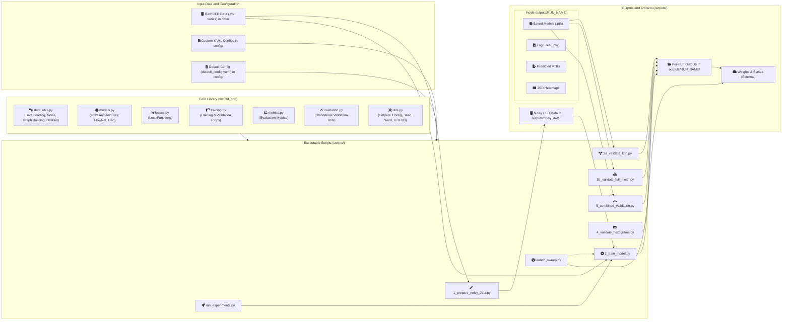
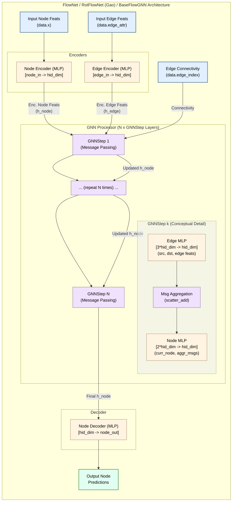
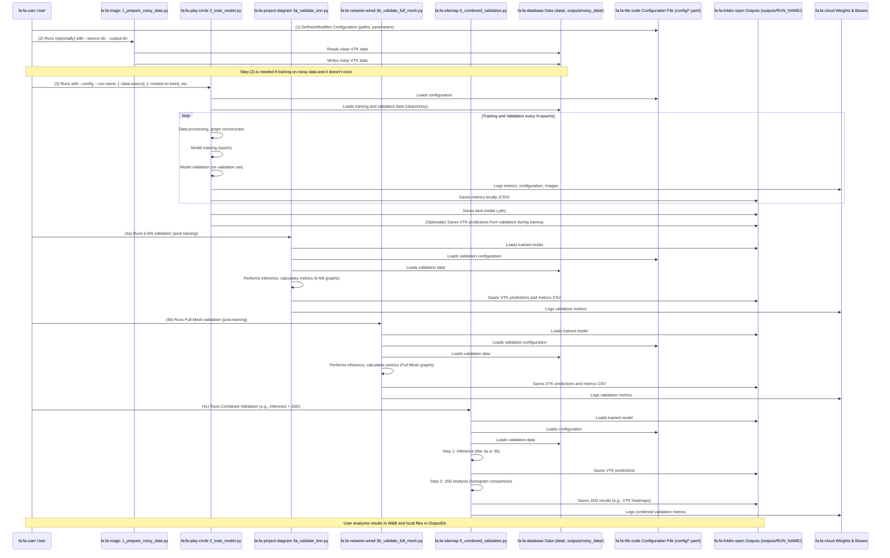

# CFD GNN Project

This project offers a suite for training and validating Graph Neural Network (GNN) models on Computational Fluid Dynamics (CFD) data. It supports noise injection, model training (FlowNet, RotFlowNet/Gao), various validation techniques (k-NN graph based, full mesh graph based, histogram JSD analysis), and Weights & Biases integration for comprehensive logging.

## Core Features

*   **Modular Library (`src/cfd_gnn/`)**: Reusable components for data processing, graph construction, GNN models, loss functions, metrics, training loops, and validation routines.
*   **Script-based Workflow (`scripts/`)**: Individual scripts for each stage of the pipeline:
    *   `1_prepare_noisy_data.py`: Generates noisy data by injecting MRI-like noise into CFD datasets.
    *   `2_train_model.py`: Main training script for GNN models.
    *   `3a_validate_knn.py`: Validates models using k-NN graphs.
    *   `3b_validate_full_mesh.py`: Validates models using full mesh (tetrahedral) graphs.
    *   `4_validate_histograms.py`: Performs standalone JSD histogram validation.
    *   `5_combined_validation.py`: Combines model inference with JSD histogram validation.
    *   `run_experiments.py`: Facilitates running sequences of predefined experiments.
    *   `launch_sweep.py`: Initiates Weights & Biases hyperparameter sweeps.
*   **Configurable Pipeline**: Uses YAML configuration files (`config/default_config.yaml`) with CLI overrides for flexible experimentation.
*   **Weights & Biases Integration**: Comprehensive logging of metrics, configurations, and artifacts.
*   **Multiple Validation Strategies**: Supports both geometry-based graph construction (k-NN) and topology-based (full mesh from tetrahedra).

## Visual Project Overview

To better understand the project's organization and typical task execution, diagrams are provided below.

### Project Component Architecture

This diagram shows the main building blocks of the project and their interconnections.



### Model Architectures

The GNN models used in this project, `FlowNet` and `RotFlowNet (Gao)`, share a common underlying architecture defined by the `BaseFlowGNN` class. The main components and data flow are illustrated below. Differences between `FlowNet` and `RotFlowNet (Gao)` typically arise from the specific input features provided during graph construction (e.g., standard Cartesian coordinates for `FlowNet` vs. potentially cylindrical or augmented features for `RotFlowNet`) rather than from a structural difference in the neural network itself.



### Workflow

This diagram illustrates the typical sequence of steps performed when working with the project, from data preparation to results analysis.



## Common Usage Scenarios (Quick Start)

This section provides command-line examples for common training and validation scenarios. Assume execution from the project root with the virtual environment activated.

**Prerequisites:**

*   **Configuration:** Settings are primarily managed via YAML files (e.g., `config/default_config.yaml`). CLI flags override YAML values.
*   **Noisy Data:** If using noisy data (`--data-source noisy` or default in config), generate it first using `scripts/1_prepare_noisy_data.py`. Ensure `noisy_train_root` and `noisy_val_root` in your config are correct.
*   **Run Name (`--run-name`):** Use a unique name for each run for output organization (`outputs/<run_name>`) and W&B tracking.
*   **Model Selection (`--models-to-train`):** Specify the model, e.g., `FlowNet` or `Gao`.

### Scenario 1: Training and Validation on CLEAN Data

*   **Goal:** Model learns and is evaluated on ideal data.
*   **How:** Use `--data-source clean`. YAML config: `validation_during_training.use_noisy_data: false`.

```bash
python scripts/2_train_model.py \
    --config config/default_config.yaml \
    --run-name training_on_clean_data \
    --models-to-train FlowNet \
    --data-source clean \
    --epochs 100
    # YAML: validation_during_training: {enabled: true, use_noisy_data: false}
```

### Scenario 2: Training and Validation on NOISY Data

*   **Goal:** Model learns and validates on noisy data.
*   **How:** Use `--data-source noisy`. YAML config: `validation_during_training.use_noisy_data: true`.
    (Ensure noisy data is prepared as per "Prerequisites".)

```bash
python scripts/2_train_model.py \
    --config config/default_config.yaml \
    --run-name training_on_noisy_data \
    --models-to-train FlowNet \
    --data-source noisy \
    --epochs 100
    # YAML: validation_during_training: {enabled: true, use_noisy_data: true}
```

### Scenario 3: Training on CLEAN Data, Validation on NOISY Data

*   **Goal:** Test model trained on ideal data against noisy conditions.
*   **How:** Use `--data-source clean`. YAML config: `validation_during_training.use_noisy_data: true`.

```bash
python scripts/2_train_model.py \
    --config config/default_config.yaml \
    --run-name train_clean_val_noisy \
    --models-to-train FlowNet \
    --data-source clean \
    --epochs 100
    # YAML: validation_during_training: {enabled: true, use_noisy_data: true}
    # Ensure noisy_val_root in YAML points to noisy validation data.
```

### Scenario 4: Training on NOISY Data, Validation on CLEAN Data

*   **Goal:** Test model trained on noisy data against ideal conditions.
*   **How:** Use `--data-source noisy`. YAML config: `validation_during_training.use_noisy_data: false`.

```bash
python scripts/2_train_model.py \
    --config config/default_config.yaml \
    --run-name train_noisy_val_clean \
    --models-to-train FlowNet \
    --data-source noisy \
    --epochs 100
    # YAML: validation_during_training: {enabled: true, use_noisy_data: false}
    # Ensure val_root in YAML points to clean validation data.
```

### Scenario 5: Controlling Graph Type (k-NN vs. Full Mesh)

*   **Goal:** Choose the graph construction method.
*   **How:** Set in YAML config (e.g., `my_custom_config.yaml`):
    *   `default_graph_type: "knn"` (define `graph_config.k`, `graph_config.down_n`).
    *   `default_graph_type: "full_mesh"`.

**Example YAML Snippet:**
```yaml
# ... other settings ...
default_graph_type: "knn"
graph_config:
  k: 12
  down_n: 20000
# ... rest of settings ...
```
Then, run training:
```bash
python scripts/2_train_model.py --config config/my_custom_config.yaml --run-name training_with_knn --models-to-train FlowNet
```

### Running Multiple Experiments (`scripts/run_experiments.py`)

This script runs a series of predefined experiments.
1.  **Modify `scripts/run_experiments.py`**:
    *   Set `BASE_CONFIG_PATH` to your base YAML configuration.
    *   Define parameter overrides for each experiment in the `experiments` list.

**Example `experiments` list structure in `run_experiments.py`:**
```python
experiments = [
    {
        "run_name_suffix": "experiment_A",
        "data_source": "clean",
        "models_to_train": ["FlowNet"],
        # ... other overrides ...
    },
    # ... more experiments ...
]
```
Execute with: `python scripts/run_experiments.py`


## Project Architecture and Workflow

This project facilitates the training and evaluation of Graph Neural Networks for CFD predictions. The architecture revolves around a core library (`src/cfd_gnn/`), executable scripts (`scripts/`), and configuration files (`config/`).

### Core Components

*   **`config/`**: Contains YAML files. `default_config.yaml` provides baseline parameters for the pipeline. Custom configs manage specific experiments and can be overridden by CLI arguments.

*   **`data/`**: Default location for input CFD datasets (series of VTK files per case).
    *   Datasets typically consist of multiple "cases" (e.g., `sUbend_011`, `sUbend_012`).
    *   Each case contains time-series VTK files (e.g., `Frame_00_data.vtk`) usually in a `CFD/` subdirectory.

*   **`outputs/`**: Default directory for generated outputs (models, logs, predictions), typically gitignored. A subdirectory is made per run.
    *   Contents include:
        *   Model checkpoints (`.pth`).
        *   Log files (`.csv`).
        *   Predicted VTK files.
        *   Visualizations (JSD heatmaps, slice plots).
        *   W&B logs.

*   **`scripts/`**: Python scripts for pipeline stages:
    *   `1_prepare_noisy_data.py`: Injects MRI-like noise into CFD data.
    *   `2_train_model.py`: Main training script: handles data loading, model initialization, training loop, validation, metric logging, and checkpointing.
    *   `3a_validate_knn.py`: Validates models using k-NN graphs.
    *   `3b_validate_full_mesh.py`: Validates models using graphs from tetrahedral mesh connectivity.
    *   `4_validate_histograms.py`: Performs standalone JSD histogram validation between two VTK datasets.
    *   `5_combined_validation.py`: Orchestrates model inference followed by JSD histogram analysis.
    *   `7_create_visualizations.py`: Generates interactive HTML plots from probe data CSVs.
    *   `run_experiments.py`: Automates running multiple predefined experimental configurations.
    *   `launch_sweep.py`: Initializes and runs Weights & Biases hyperparameter sweeps.

*   **`src/cfd_gnn/`**: Core Python library with reusable logic:
    *   `__init__.py`: Package initializer.
    *   `data_utils.py`: VTK data loading, noise injection, graph construction (k-NN, full mesh), and `PairedFrameDataset` for PyTorch Geometric.
    *   `losses.py`: Custom loss functions (supervised MSE, physics-informed divergence loss, histogram loss).
    *   `metrics.py`: Evaluation metrics (TKE, Cosine Similarity, JSD, vorticity, slice-based analysis).
    *   `models.py`: GNN architectures (`FlowNet`, `RotFlowNet/Gao`) and building blocks (MLPs, GNN steps).
    *   `training.py`: Core training (`train_single_epoch`) and validation (`validate_on_pairs`) loops.
    *   `utils.py`: Helpers for config loading, seeding, W&B init, device selection, VTK I/O.
    *   `validation.py`: Standalone validation utilities, including JSD histogram analysis pipeline.

### Workflow Overview

The typical project workflow is:

1.  **Data Preparation**:
    *   Store raw CFD datasets (VTK series per case) in a directory (e.g., `data/my_dataset_clean`).
    *   (Optional) For noisy data training, generate it using `scripts/1_prepare_noisy_data.py`:
        ```bash
        python scripts/1_prepare_noisy_data.py --source-dir path/to/clean --output-dir path/to/noisy [--p-min X --p-max Y]
        ```

2.  **Configuration**:
    *   Configure paths, model/training parameters, graph settings, W&B details, etc., in `config/default_config.yaml` or a custom YAML file.

3.  **Model Training**:
    *   Execute `scripts/2_train_model.py` with your config, run name, and target models:
        ```bash
        python scripts/2_train_model.py --config my_config.yaml --run-name my_run --models-to-train FlowNet
        ```
    *   The script:
        *   Loads datasets.
        *   Constructs graph pairs (`PairedFrameDataset`).
        *   Initializes GNN model(s).
        *   Runs training loop (`training.py`) with specified losses (`losses.py`).
        *   Periodically validates and calculates metrics (`metrics.py`).
        *   Logs to W&B and local CSVs.
        *   Saves best model checkpoints to `outputs/<run_name>/models/`.

4.  **Model Validation & Analysis**:
    *   Use saved checkpoints for detailed validation:
    *   **k-NN Graph Validation**:
        ```bash
        python scripts/3a_validate_knn.py --model-checkpoint path/to/model.pth --model-name FlowNet [...]
        ```
    *   **Full Mesh Graph Validation**:
        ```bash
        python scripts/3b_validate_full_mesh.py --model-checkpoint path/to/model.pth --model-name FlowNet [...]
        ```
    *   **Combined Validation (Inference + JSD)**:
        ```bash
        python scripts/5_combined_validation.py --model-checkpoint path/to/model.pth --model-name FlowNet [...]
        ```
    *   Validation scripts:
        *   Load validation data.
        *   Construct graphs per frame.
        *   Perform model inference.
        *   Calculate comprehensive metrics (overall, per-case, per-frame, per-slice).
        *   Save metrics to CSVs and predicted VTKs.
        *   Log to W&B.

5.  **Results Review**:
    *   Review W&B dashboards.
    *   Inspect detailed CSV metric files.
    *   Visualize predicted VTKs in ParaView.

This modular structure enables flexible experimentation and extension.

## Project Structure

```
.
├── config/
│   └── default_config.yaml       # Default configuration for all scripts
├── data/
│   └── .gitkeep                  # Placeholder for input CFD datasets (see below)
├── outputs/
│   └── .gitkeep                  # Default for generated outputs (models, predictions, logs) - gitignored
├── scripts/                      # Executable Python scripts for pipeline stages
│   ├── 1_prepare_noisy_data.py
│   ├── 2_train_model.py
│   ├── 3a_validate_knn.py
│   ├── 3b_validate_full_mesh.py
│   ├── 4_validate_histograms.py
│   ├── 5_combined_validation.py
│   ├── 7_create_visualizations.py
│   ├── launch_sweep.py
│   ├── run_experiments.py
├── src/
│   └── cfd_gnn/                  # Core library package
│       ├── __init__.py
│       ├── data_utils.py         # Data loading, noise, graph building, Dataset class
│       ├── losses.py             # Custom loss functions
│       ├── metrics.py            # Evaluation metrics (TKE, CosSim, JSD, Vorticity)
│       ├── models.py             # GNN model definitions (FlowNet, RotFlowNet)
│       ├── training.py           # Training and during-training validation loops
│       ├── utils.py              # General helper functions (config, seed, W&B, VTK I/O)
│       └── validation.py         # Standalone validation utilities (JSD pipeline)
├── tests/                        # (Optional) Unit and integration tests
├── .gitignore
├── README.md
└── requirements.txt
```

## Setup

1.  **Clone Repository**:
    ```bash
    git clone <repository_url>
    cd cfd-gnn-project # Or your chosen directory name
    ```

2.  **Create Virtual Environment** (recommended):
    ```bash
    python -m venv venv
    source venv/bin/activate  # On Linux/macOS
    # venv\Scripts\activate   # On Windows
    ```

3.  **Install Dependencies**:
    ```bash
    pip install -r requirements.txt
    ```
    *Note: `torch`, `torch-scatter`, `torch-geometric` might need specific installation commands depending on your CUDA version. Refer to their official documentation. Ensure `scipy`, `plotly`, `kaleido` are included in `requirements.txt` if using time-series probing and visualization features.*

4.  **Prepare Data**:
    *   Place CFD datasets (series of `.vtk` files) into `data/`.
    *   Expected structure for a dataset (e.g., "CFD_Ubend_other_val"):
        ```
        data/
        └── CFD_Ubend_other_val/
            ├── sUbend_011/
            │   └── CFD/
            │       ├── Frame_00_data.vtk
            │       └── ...
            └── sUbend_012/
                └── CFD/
                    ├── Frame_00_data.vtk
                    └── ...
        ```
    *   Update data paths in `config/default_config.yaml` or use CLI arguments.

5.  **Weights & Biases Setup (Optional)**:
    *   For W&B logging: `wandb login`
    *   Specify W&B project/entity in `config/default_config.yaml` or use script defaults.

## Configuration System

*   `config/default_config.yaml` provides default parameters.
*   Custom YAML configs (e.g., `my_experiment_config.yaml`) can be passed via `--config path/to/config.yaml`.
*   CLI arguments override YAML values.

## Usage Examples

Run scripts from the project root.

**1. Prepare Noisy Data:**
Generates a noisy version of a dataset.
```bash
python scripts/1_prepare_noisy_data.py \
    --source-dir path/to/clean_data_dir \
    --output-dir path/to/noisy_data_dir \
    --p-min 0.05 --p-max 0.15 --overwrite
```
*   `--source-dir`: Directory of original CFD cases.
*   `--output-dir`: Where to save the noisy dataset.
*   `--p-min`, `--p-max`: Noise percentage range.
*   `--overwrite`: If set, overwrites existing output.

**2. Train a Model:**
Trains specified GNN models (e.g., FlowNet, Gao/RotFlowNet).
```bash
# Example: Training with noisy data (default in config, or via --data-source noisy)
python scripts/2_train_model.py \
    --config config/my_config.yaml \
    --run-name my_flownet_run \
    --models-to-train FlowNet \
    --epochs 100

# Example: Training with clean data
python scripts/2_train_model.py \
    --config config/my_config.yaml \
    --run-name my_flownet_clean_run \
    --models-to-train FlowNet \
    --epochs 100 \
    --data-source clean
```
*   `--config`: Path to training configuration YAML.
*   `--run-name`: Unique name for the run (creates `outputs/<run_name>`).
*   `--models-to-train`: Model(s) to train (e.g., `FlowNet`, `Gao`).
*   `--data-source`: `noisy` or `clean`.

**3. Validate Model with k-NN Graphs:**
Validates a model checkpoint using k-NN graphs.
```bash
python scripts/3a_validate_knn.py \
    --model-checkpoint outputs/my_flownet_run/models/flownet_best.pth \
    --model-name FlowNet \
    --val-data-dir path/to/validation_data \
    --output-dir outputs/my_flownet_run/validation_knn \
    --k-neighbors 12 --no-downsample
```
*   `--model-checkpoint`: Path to the saved model (`.pth`).
*   `--model-name`: Model architecture (FlowNet, Gao).
*   `--val-data-dir`: Directory of validation data.
*   `--output-dir`: For prediction VTKs and metrics.

**4. Validate Model with Full Mesh Graphs:**
Validates a model using full mesh graphs.
```bash
python scripts/3b_validate_full_mesh.py \
    --model-checkpoint outputs/my_flownet_run/models/flownet_best.pth \
    --model-name FlowNet \
    --val-data-dir path/to/validation_data \
    --output-dir outputs/my_flownet_run/validation_fullmesh
```
*   (Key arguments similar to k-NN validation, without k-NN specifics.)

**5. Perform Standalone JSD Histogram Validation:**
Compares two VTK datasets using JSD histograms.
```bash
python scripts/4_validate_histograms.py \
    --real-data-dir path/to/ground_truth_data \
    --pred-data-dir path/to/predicted_data \
    --output-dir outputs/my_flownet_run/jsd_validation \
    --velocity-key-real U_gt --velocity-key-pred velocity_pred
```
*   `--real-data-dir`: Reference (ground truth) dataset.
*   `--pred-data-dir`: Predicted dataset.
*   `--output-dir`: For JSD heatmap VTKs.

**6. Run Combined Validation (Inference + JSD):**
Runs inference and subsequent JSD validation.
```bash
python scripts/5_combined_validation.py \
    --model-checkpoint outputs/my_flownet_run/models/flownet_best.pth \
    --model-name FlowNet \
    --val-data-dir path/to/validation_data \
    --output-dir outputs/my_flownet_run/combined_validation_knn \
    --graph-type knn --k-neighbors 12
```
*   `--graph-type`: `knn` or `full_mesh` for inference.

**7. Launch Hyperparameter Sweep:**
Initializes a W&B sweep and starts an agent.
```bash
python scripts/launch_sweep.py \
    --sweep-config sweep_config_example.yaml \
    --project my_wandb_project \
    --count 5
```
*   `--sweep-config`: Path to W&B sweep YAML configuration file.
*   `--project` (Optional): W&B project name.
*   `--count` (Optional): Number of agent runs.

## Development Notes

*   **Device Management**: Scripts use CUDA if available and specified; CPU otherwise.
*   **VTK Keys**: Ensure VTK field keys in config (e.g., `velocity_key`, `pressure_key`) match your data.
*   **Error Handling**: Basic error handling is included; complex data issues may need debugging.
*   **Testing**: Add unit tests to `tests/` for core library functions.

## Future Enhancements (Ideas)

*   More sophisticated data augmentation techniques.
*   Support for additional GNN architectures.
*   More detailed post-processing and visualization tools (e.g., velocity profile plots at key cross-sections, pressure drop calculations).
*   Integration with workflow management tools (e.g., Snakemake, Nextflow).

## Time-Series Probing and Analysis

This project includes capabilities to extract time-series data at specific user-defined points and planar slices from VTK simulation outputs. It can also calculate several Navier-Stokes related quantities at these probe locations.

### 1. Time Extraction from VTK

The system attempts to extract time information from VTK files to associate it with each data frame.

**Configuration (`config/default_config.yaml`):**

The `time_extraction` section in the configuration file controls how time is determined:

```yaml
time_extraction:
  # method_priority: Defines the order of methods to attempt for extracting time.
  #   - "field_data": Looks in VTK's field data arrays (e.g., global time value).
  #   - "filename": Parses the VTK filename using a regex.
  #   - "fixed_dt": Calculates time as frame_index * simulation_dt.
  method_priority: ["field_data", "filename", "fixed_dt"]

  # field_data_keys: List of keys to search for in mesh.field_data.
  field_data_keys: ["TimeValue", "TIME", "Time", "time"]

  # filename_pattern: Regex for "filename" method. Must have one capturing group for the time value.
  # Example: ".*_t(\\d+\\.\\d+)\\.vtk" (for "case_t0.015.vtk")
  filename_pattern: null

  # simulation_dt: Fixed time step for "fixed_dt" method.
  simulation_dt: 0.01
```
The `data_utils.py` script uses this configuration when loading VTK files, adding a `data.time` attribute to the PyTorch Geometric `Data` objects.

### 2. Point and Slice Probes

You can define specific points and slices where data (velocity, vorticity, gradients, divergence) should be extracted over time.

**Configuration (`config/default_config.yaml`):**

The `analysis_probes` section controls this:

```yaml
analysis_probes:
  points:
    enabled: false # Set to true to enable
    coordinates: # List of [x,y,z] coordinates
      # - [0.05, 0.01, 0.0]
      # - [0.10, 0.02, 0.0]
    velocity_field_name: "velocity"

  slices:
    enabled: false # Set to true to enable
    definitions: # List of slice definitions
      # - {axis: "X", position: 0.05, thickness: 0.005}
      # - {axis: "Y", position: 0.0,  thickness: 0.01}
    velocity_field_name: "velocity_on_slice"
```

*   **Point Probes**: Data is sampled at the mesh node nearest to each specified coordinate.
*   **Slice Probes**: Data is extracted for all mesh nodes falling within the defined slice (axis, position, thickness). For CSV outputs, metrics are typically averaged over the slice.

### 3. Generating Probe Data

`scripts/5_combined_validation.py` generates this time-series probe data.

*   **Execution**:
    1.  Enable and configure `time_extraction` and `analysis_probes` in your YAML configuration.
    2.  Run the script:
        ```bash
        python scripts/5_combined_validation.py --config your_config.yaml --model-checkpoint model.pth --model-name ModelName --val-data-dir validation_cases --output-dir output_run_dir
        ```
*   **Output**:
    *   `probed_points_data_MODEL_GRAPH.csv` (if point probes enabled) in `output_run_dir/model_predictions/`.
    *   `probed_slices_data_MODEL_GRAPH.csv` (if slice probes enabled) in `output_run_dir/model_predictions/`.
    *   CSVs include time, probe details, true/predicted velocity, vorticity, divergence, and gradients.

**Output CSV Structure (Example Columns):**

*   **Points CSV**: `case_name, frame_file, time, target_point_coords, actual_point_coords, true_velocity, pred_velocity, true_vort_mag, pred_vort_mag, ...true_divergence, pred_divergence`
    (Vector quantities are string representations of lists).

*   **Slices CSV**: `case_name, frame_file, time, slice_axis, slice_position, avg_true_vel_mag, avg_pred_vel_mag, avg_true_vort_mag_slice, avg_pred_vort_mag_slice, ...`

This data can be used for detailed analysis or as input for time-dependent modeling.

### 4. Visualizing Probe Data

`scripts/7_create_visualizations.py` generates interactive HTML plots from probe data CSVs.

*   **Execution**:
    ```bash
    python scripts/7_create_visualizations.py \
        --points-csv path/to/probed_points_data.csv \
        --slices-csv path/to/probed_slices_data.csv \
        --output-dir path/to/visualizations/ \
        --model-name "ModelDisplayName"
    ```
    (Provide one or both CSV paths)
*   **Output**: Interactive HTML line plots comparing true vs. predicted quantities over time for each probe.

### 5. Dependencies for Probing/Visualization

Required dependencies for these features (ensure they are in `requirements.txt`):
*   `scipy`: For nearest-neighbor lookups (point probing).
*   `plotly`: For interactive visualizations.
*   `kaleido`: For static image export from Plotly (optional, HTML is default).
The main `requirements.txt` should include these if these features are core.
